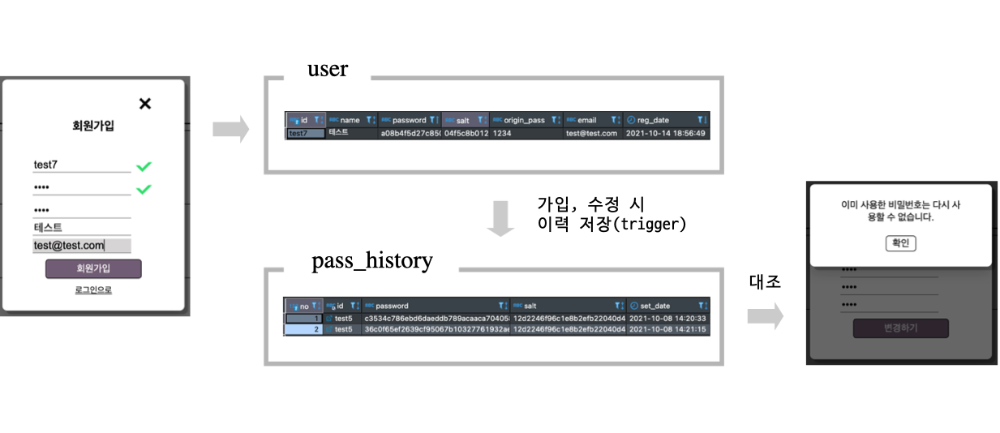
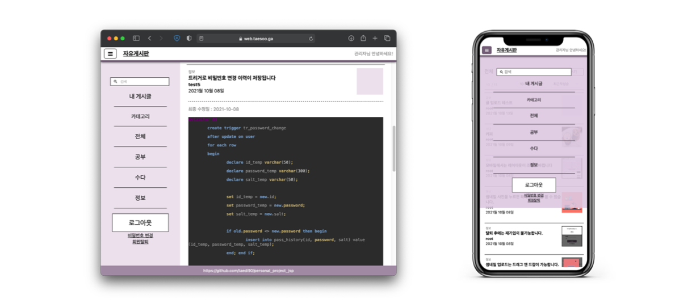
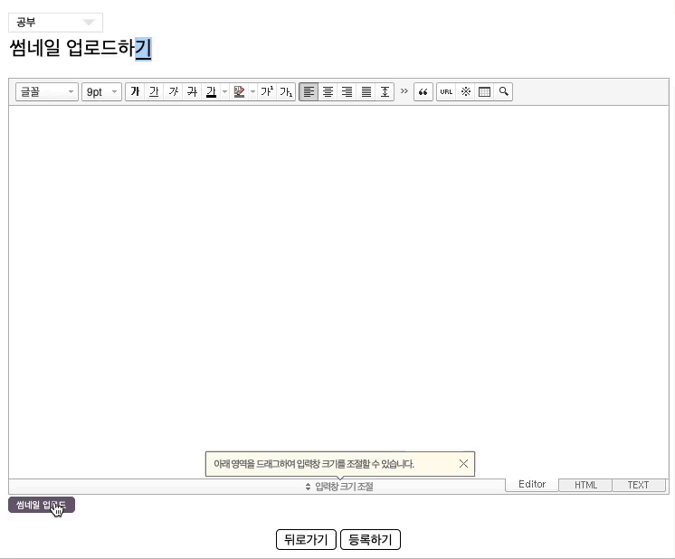
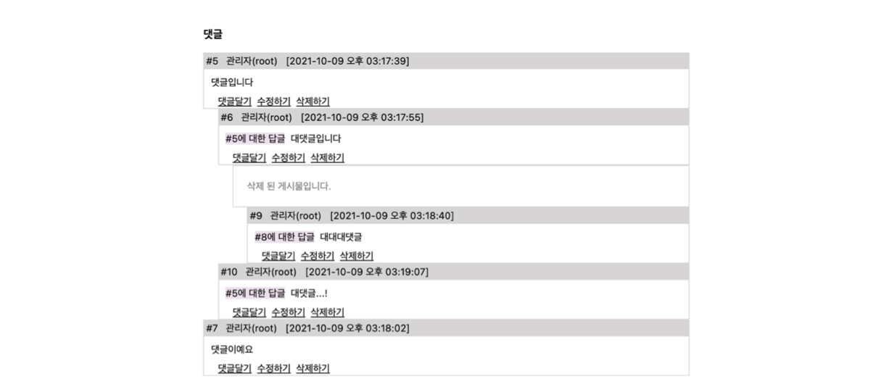
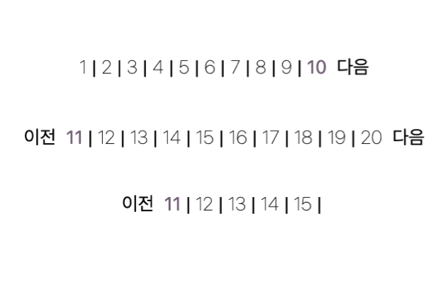
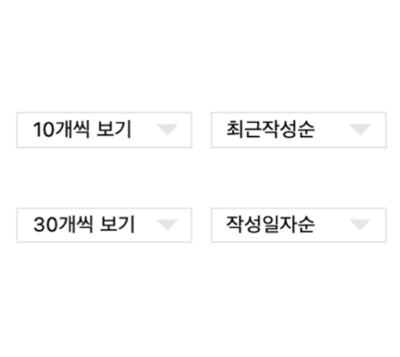

# personal_project_jsp
JSP MVC 개인 웹 프로젝트

## 차례

[프로젝트 소개](#프로젝트-소개)  
[적용해본 것](#적용해본-것)
[데모 링크](#데모-링크)  
[외부 리소스](#외부-리소스)

## 프로젝트 소개

JSP로 기본 CRUD를 구현하기 위한 게시판을 만들어 보았습니다. 

### 환경

- JDK 8u202
- Maven 3.8.4
- Server: CentOS8, Docker (20.10.11), Tomcat (8.5.69), MariaDB (latest), Nginx (latest), Jenkins (lts)

### 기간

- 약 3주

## 적용해본 것

### 🔐 비밀번호 암호화 및 이력관리



단방향 해시함수와 salt, stretching 을 적용시켜 회원 정보 저장 시 비밀번호를 암호화하는 로직을 구성하였습니다.

```java
public String getHashing(String password, String salt) {

    System.out.println("original password :" + password);
    System.out.println("original salt :" + salt);

    byte[] bytePassword = password.getBytes();

    int stretching = 10000; // key stretching 횟수
    MessageDigest md = null;

    try {
        md = MessageDigest.getInstance("SHA-256");
    } catch (NoSuchAlgorithmException e) {
        e.printStackTrace();
    }

    for(int i = 0; i < stretching; i++){
        String temp = byteToString(bytePassword) + salt; // 패스워드와 salt 결합
        md.update(temp.getBytes()); // temp 문자열을 해싱해 md에 저장
        bytePassword = md.digest(); // 패스워드 갱신
    }

    System.out.println("hashed password :" + byteToString(bytePassword));

    return byteToString(bytePassword);
}
```

DB의 trigger 기능을 활용하여 비밀번호 변경 이력을 저장, 기존 비밀번호는 재사용이 불가능하도록 구성하였습니다.

```mysql
delimiter $$

	create trigger tr_password_change
	after update on user 
	for each row 

	begin 

		declare id_temp varchar(50);

		declare password_temp varchar(300);

		declare salt_temp varchar(50);
	
		set id_temp = new.id;
		set password_temp = new.password;
		set salt_temp = new.salt;

		if old.password <> new.password then begin

			insert into pass_history(id, password, salt) value (id_temp, password_temp, salt_temp);

		end; end if;
		
	end $$

delimiter ;

delimiter $$

	create trigger tr_password_init
	after insert on user 
	for each row 

	begin 

		declare id_temp varchar(50);
		declare password_temp varchar(300);
		declare salt_temp varchar(50);

		set id_temp = new.id;
		set password_temp = new.password;
		set salt_temp = new.salt;

		insert into pass_history(id, password, salt) value (id_temp, password_temp, salt_temp);

	end $$

delimiter ;
```

### 🧲 반응형 디자인



브라우저 크기에 따라 레이아웃이 수정되도록 구성하여 모바일과 PC 에서의 사용자 환경을 동시에 충족시키는 방법을 고려하였습니다.

### 🗃 파일 업로드 및 리사이즈



Drag & Drop 업로드 - 확장자 확인 - 파일 리사이즈 - 임의 폴더 생성 및 외부 저장소 저장 (패턴화 방지 및 deploy 간 데이터 유실 방지)

### 📬 nested comments(대댓글)



depth 에 상관없이 nested comment 를 작성할 수 있도록 구성하였고, 화면에서 댓글 폭은 클라이언트 기준 60% 까지만 축소되도록 계층 생성에 따라 width 를 재조정 해주었습니다.
```java
if(rs.next()) {
    list = new LinkedList<Comment>(); 
    long parent = 0;
    do {

        comment = getComment(rs);
        
        // 댓글들 순서대로 정렬하기
        if(comment.getDepth() == 1) { 
            list.add(0, comment);  // 최상위 댓글들은 리스트 앞에 추가 (내림차순 -> 오름차순)
        }else {
            parent = comment.getpCno();
            int i = 0;
            
            for(Comment c : list) {
                if(parent == c.getCno()) {
                    list.add(i+1, comment); // 하위 댓글들은 상위 댓글 뒤에 끼워넣기 (내림차순 -> 오름차순)
                    break;
                }
                i++;
            }
            
        }
        
    }while(rs.next());
    
}
```
### ⛓ 페이징 처리 & 정렬방식 변경 기능 구현

페이징 처리|정렬방식 변경
|---|---|
|

## 데모 링크

- [https://web.taedi.net/board/](https://web.taedi.net/board/)

## 외부 리소스

- 아이콘 - 자체제작
